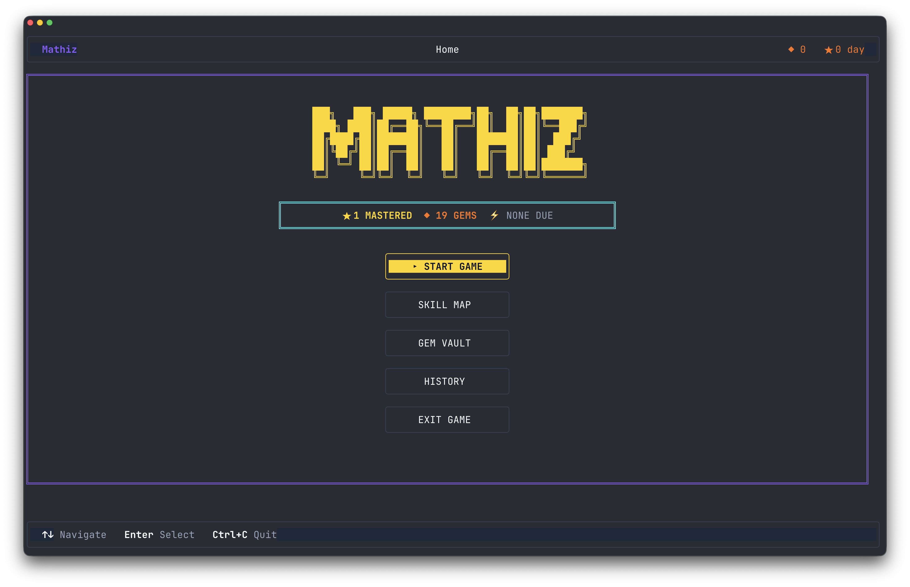

# Mathiz

AI powered math playground in the terminal. 
Mathiz helps kids (grades 2-5) build math mastery through adaptive practice, spaced repetition, and LLM generated questions.
Mathiz is backed by a static [skill graph](./internal/skillgraph/seed.go), [rule based adaptive
learning](./internal/mastery/) and [positive reinforcement](./internal/gems/) to make it
explainable, constrained, and fun.

Built with [Claude Code](https://code.claude.ai) using a spec driven development approach. See
[specs](./specs/) and [author notes](/specs/notes.md) for details.

<div align="center">
  <picture>
    
  </picture>
</div>

## Install

```sh
curl -fsSL https://raw.githubusercontent.com/abhisek/mathiz/main/install.sh | sh
```

Or download a binary manually from [GitHub Releases](https://github.com/abhisek/mathiz/releases).

## Setup

Mathiz requires an LLM API key. It automatically discovers keys from standard environment variables (checked in this order):

| Env var | Provider | Default model |
|---------|----------|---------------|
| `GEMINI_API_KEY` | Gemini | gemini-2.0-flash |
| `OPENAI_API_KEY` | OpenAI | gpt-4o-mini |
| `ANTHROPIC_API_KEY` | Anthropic | claude-haiku-4.5 |
| `OPENROUTER_API_KEY` | OpenRouter | google/gemini-2.0-flash-exp |

If you already have one of these set, Mathiz will just work. To override the auto-detected provider or use a custom model:

```sh
export MATHIZ_LLM_PROVIDER=gemini              # force a specific provider
export MATHIZ_GEMINI_MODEL=gemini-2.0-pro      # override default model
export MATHIZ_OPENROUTER_MODEL=anthropic/claude-3-haiku  # override OpenRouter model
```

## Usage

```sh
mathiz          # launch the TUI (welcome → home → session)
mathiz play     # jump straight into a practice session
mathiz stats    # view learning stats
mathiz llm      # inspect LLM usage
mathiz update   # update to the latest version
mathiz reset    # reset all progress
```

## Multiple Profiles

All progress is stored in a single SQLite file. Use the `--db` flag to maintain separate profiles for different learners:

```sh
mathiz --db ~/mathiz-alice.db       # Alice's profile
mathiz --db ~/mathiz-bob.db         # Bob's profile
mathiz stats --db ~/mathiz-alice.db # Alice's stats
```

You can also set the `MATHIZ_DB` environment variable instead. The `--db` flag takes priority over the env var.

## Standard

The current skill graph is based on [Common Core](https://www.thecorestandards.org/Math/) standard.
But the system is designed to support multiple standards and curriculum.

## Guides

- [Skill Preview](./docs/skill-preview.md) — browse skills and test LLM-generated questions without a database
- [LLM Usage Auditing](./docs/llm-usage-auditing.md) — inspect LLM requests, responses, and token usage

## Build from source

Requires Go 1.25+.

```sh
git clone https://github.com/abhisek/mathiz.git
cd mathiz
make
```

## Limitations

- Windows self-update using `mathiz update` fails due to platform restrictions.

## License

MIT
